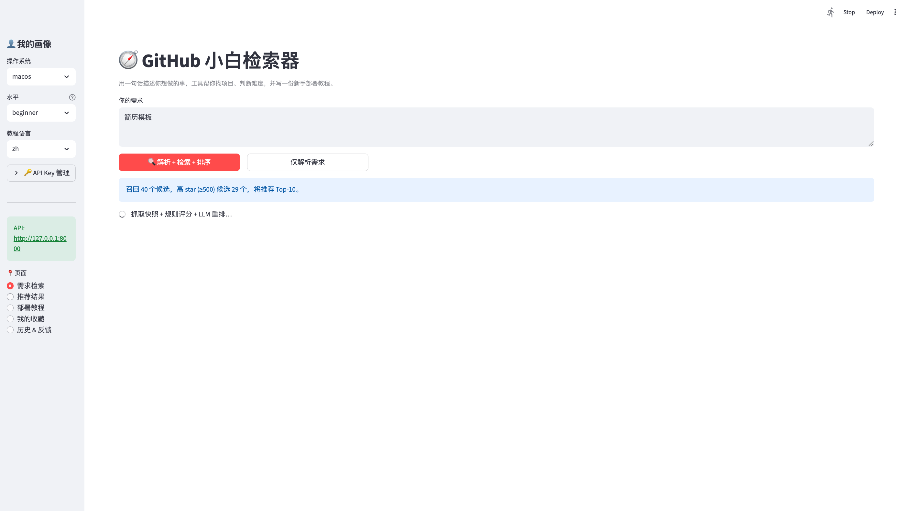
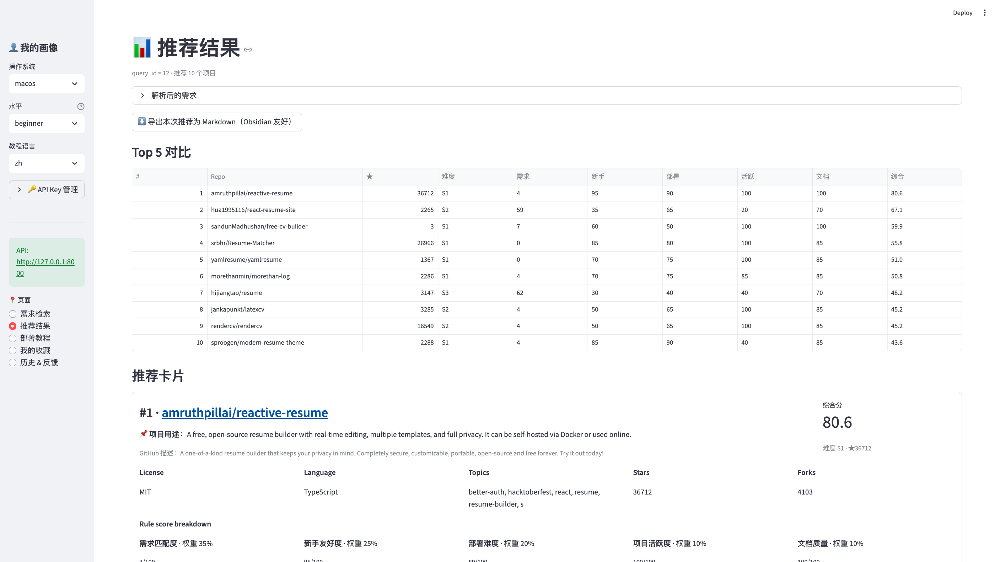
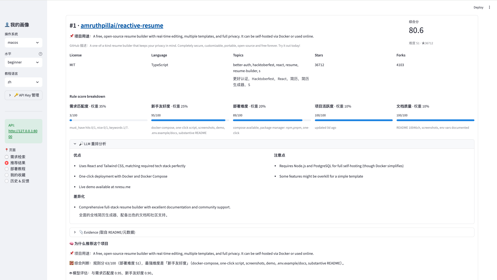
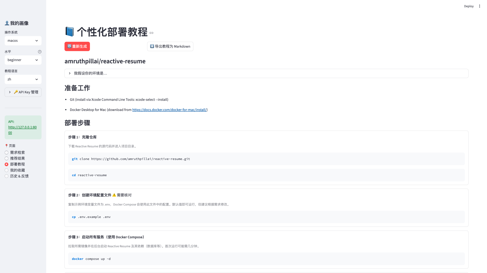

# GitHub Newbie Finder · github-newbie-finder

[](LICENSE)


🌐 **Language**: English · [中文](README.md)

> Describe your need in one sentence — get the top GitHub projects ranked for beginners, plus a personalised, step-by-step deployment tutorial. Bilingual zh / en Markdown export drops cleanly into Obsidian.

> Note on UI language: this is primarily a Chinese-targeted tool, so the Streamlit UI labels are in Chinese. The **content** (what the LLM produces — recommendation summaries, pros / cons, tutorials, Markdown exports) follows the **教程语言 / Tutorial language** dropdown in the sidebar (`zh` / `en`).

---

## Screenshots

Search → adaptive Top-N → recommendation cards → personalised tutorial — end-to-end in the browser.

**1. Enter a need · adaptive Top-N**

When there are many high-star (≥500) candidates, Top-N expands automatically from 5 → 7 → 10.



**2. Top-10 comparison table**

Five dimensions at a glance: fit · beginner-friendly · deployability · activity · documentation.



**3. Recommendation cards: score breakdown · LLM analysis · evidence**

Every recommendation shows what each rule score is based on, plus the LLM's pros / cons and README excerpts that backed every claim.



**4. Personalised tutorial**

The tutorial is tailored to your OS and skill level. Steps the LLM is unsure about are tagged "⚠️ needs verification" so it can't quietly hallucinate commands.



---

## What it does

1. **Parse the need**: turn a sentence like _"a local-first RAG knowledge base, ideally with a Web UI, no Docker headaches"_ into structured constraints + English search keywords.
2. **Recall + score**: hit the GitHub Search API → fetch README / tree → score on five dimensions (fit / beginner-friendly / deployability / activity / docs) → LLM rerank.
3. **Write a deployment tutorial**: based on the repo snapshot + your profile (OS / skill / language), generate a runnable step-by-step tutorial. Steps the LLM is uncertain about are flagged.
4. **Keep what you find**: ⭐ favorites, 🗂 history replay, ⬇️ one-click Markdown export to Obsidian.

## Highlights

- 🔑 **Multi-API-key management in the UI** — add / switch / delete DeepSeek / OpenAI / Anthropic credentials, no `.env` reload required.
- 🤖 **Pluggable LLM provider** — DeepSeek / OpenAI / Anthropic, or `LLM_PROVIDER=echo` for a deterministic stub that runs the whole pipeline with no key.
- 📊 **Explainable** — every recommendation comes with a 5-dimension score breakdown, LLM pros / cons, and README evidence excerpts.
- ⭐ **Replayable history** — every query, recommendation, and tutorial is persisted in SQLite; click any history row to jump back to the original results.
- ⬇️ **Markdown export (zh / en)** — recommendations and tutorials export to `.md` with YAML frontmatter; drop into an Obsidian vault and it Just Works.
- 🎯 **Adaptive Top-N** — when high-star candidates are plentiful, the result list grows from Top-5 to Top-7 / Top-10 automatically.
- 🔁 **Every LLM call is replayable** — written to the `llm_calls` table for debugging.

## Quick start

```bash
git clone https://github.com/Guzi212/github-newbie-finder.git
cd github-newbie-finder

python3 -m venv .venv && source .venv/bin/activate
pip install -r requirements.txt

cp .env.example .env  # edit if you want a real LLM; `echo` works without keys

# Terminal A — backend (recommended: logs go to logs/backend.log)
python -m app.cli init-db
bash scripts/run-backend.sh        # background
# or: bash scripts/run-backend.sh fg  # foreground, see live logs

# Terminal B — frontend
streamlit run streamlit_app.py
```

> You can also `uvicorn app.main:app --reload --port 8000` directly, but tracebacks won't be captured. The launcher script always tees to `logs/backend.log`, so when something 500s you can `tail -f logs/backend.log` and see the stack.

Open the URL Streamlit prints (default `http://localhost:8501`); the home page is "需求检索" (Search).

### Day-to-day: one-click launcher (macOS)

Once the initial setup is done, macOS users can create two double-click Desktop entries:

```bash
chmod +x scripts/launch.command scripts/stop.command
ln -sf "$PWD/scripts/launch.command" ~/Desktop/"启动 GitHub 小白检索器.command"
ln -sf "$PWD/scripts/stop.command"   ~/Desktop/"停止 GitHub 小白检索器.command"
```

- Double-click **`启动 GitHub 小白检索器.command`** → starts backend (`:8000`) and Streamlit (`:8501`); if either is already running it's skipped (no re-kill); waits for readiness then opens `http://localhost:8501`.
- Double-click **`停止 GitHub 小白检索器.command`** → stops both services.

> ⚠️ Services run in the background via `nohup`: **closing the browser tab or the Terminal window will NOT stop them** — use the stop launcher above, or run `pkill -f 'uvicorn app.main' ; pkill -f 'streamlit run streamlit_app'` manually.

### Configuring API keys

1. **In the UI (recommended)**: open the sidebar `🔑 API Key 管理` expander, paste your key, hit save, then activate it. Multiple credentials are stored in SQLite and survive restarts.
2. **In `.env` (classic)**: edit `.env.example`, restart uvicorn. Falls back to this when no UI-managed credential is active.

> Recommend [DeepSeek](https://platform.deepseek.com): OpenAI-compatible API, cheap enough that this project runs for a long time on the cost of a coffee.

### Want to try it without an API key?

Set `LLM_PROVIDER=echo` in `.env`. The whole pipeline runs with a deterministic stub (real GitHub recall and rule scoring; the LLM parts are simulated). Enough to see how the tool works.

## Project layout

```
app/
  schemas.py         # All Pydantic models (LLM I/O contracts live here)
  db.py              # SQLite persistence (SQLAlchemy core)
  llm.py             # LLM provider abstraction + call recording
  parser.py          # Natural language → RequirementParseResult
  query_planner.py   # → list of GitHubQuery
  github.py          # GitHub REST client (recall + snapshot)
  profiler.py        # Repo snapshot → install signals (Docker / pkg / GPU…)
  scorer.py          # 5-dimension rule scoring + S1-S5 difficulty bucket
  ranker.py          # LLM rerank, merging rule + semantic scores
  tutorial.py        # User profile + repo snapshot → TutorialPlan
  exporters.py       # Recommendations / tutorial → Markdown (zh / en)
  main.py            # FastAPI app
  cli.py             # python -m app.cli init-db / replay <id>
streamlit_app.py     # 5-page UI
data/finder.db       # SQLite (gitignored, file is auto-chmod 0600)
```

## Demo scenarios

- "a beginner-friendly local RAG knowledge base, web UI preferred, no Docker hassle"
- "open-source receipt / invoice OCR for expense reporting"
- "image compression / management tool that runs on Windows without Docker"

## Pipeline overview

```
Your one-line need
  ↓ LLM #1 parse
parsed result (must_have / nice_to_have / avoid / keywords_en …)
  ↓ query_planner
5-8 GitHub search queries
  ↓ github.recall
candidate repos
  ↓ github.fetch_snapshot
README + tree + topics + license
  ↓ profiler
InstallSignals (has_compose / needs_gpu / pkg managers …)
  ↓ scorer
5-dim rule score + difficulty bucket + hard filter
  ↓ LLM #2 rerank
RepoAnalysisResult (fit / beginner / pros / cons / evidence)
  ↓ ranker.merge
Top-N recommendations (with rationale + evidence)
  ↓ click "📘 Generate tutorial"
LLM #3 tutorial
  ↓ TutorialPlan + your profile
personalised deployment tutorial
  ↓ click "⬇️ Export Markdown"
Obsidian-friendly .md
```

## Roadmap / ideas

- [ ] Write recommendations / tutorials directly into a configured Obsidian vault path (currently download-only)
- [ ] Recall via GitHub Topics for better diversity
- [ ] One-shot `docker-compose` to bring up backend + frontend
- [ ] Experiment: small fine-tune for `beginner_score`

PRs / issues welcome.

## Safety notes

- The tool **never auto-executes** any deployment commands. Steps tagged `needs_verification=true` mean the LLM wasn't sure — verify before running.
- GitHub search is rate-limited; setting `GITHUB_TOKEN` raises it from 10 → 30 req/min.
- API keys are stored **in plaintext** in SQLite; the `finder.db` file is auto-chmod 0600. On a shared device, prefer `.env` over the in-app credential store.
- A first run hits GitHub Search + three LLM calls; if your LLM is flaky, temporarily switch to `LLM_PROVIDER=echo` to demo the flow.

## License

MIT — see [LICENSE](LICENSE).
